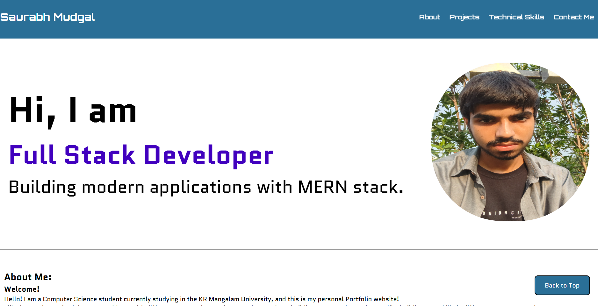
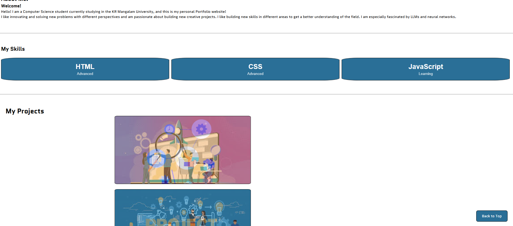
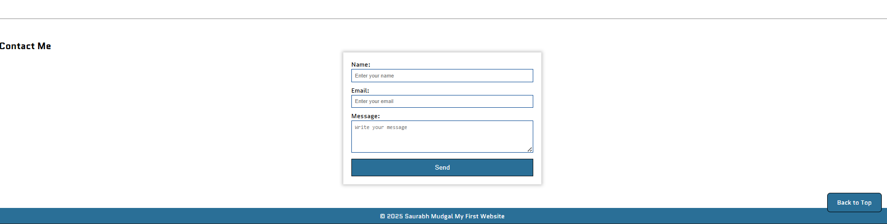

# Student Portfolio - Saurabh Mudgal

## Project Description
A responsive, static personal portfolio website designed to showcase my academic projects and development skills. This project demonstrates mastery of HTML5 semantic structure and advanced CSS3 styling techniques.

## Installation & Usage
Since this is a static website, no compilation or server setup is required.

1. **Clone the repository:**
   ```bash
   git clone [https://github.com/Saurabh-Mudgal-Dev/Portfolio-Webpage.git](https://github.com/Saurabh-Mudgal-Dev/Portfolio-Webpage.git)
2. **Navigate to the folder:**
    ```bash
    cd Portfolio-Webpage
3. **Run the application:**
    * Simply double-click index.html to open it in your default web browser.
    * Alternatively, use the "Live Server" extension in VS Code.

## Screenshot
### Desktop View of webpage



## Key Features
* Complete CSS Portfolio: A custom-built project slider using @keyframes animation (no JavaScript required).
* Responsive Design: Media queries ensure layout adapts from desktop monitors to mobile screens.
* Interactive UI: Hover effects on profile images and contact icons using CSS transforms.        